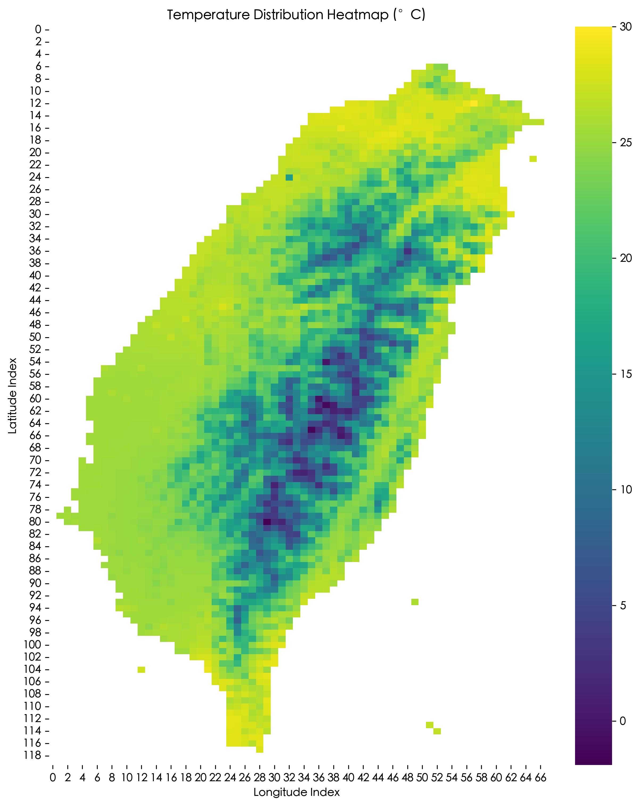
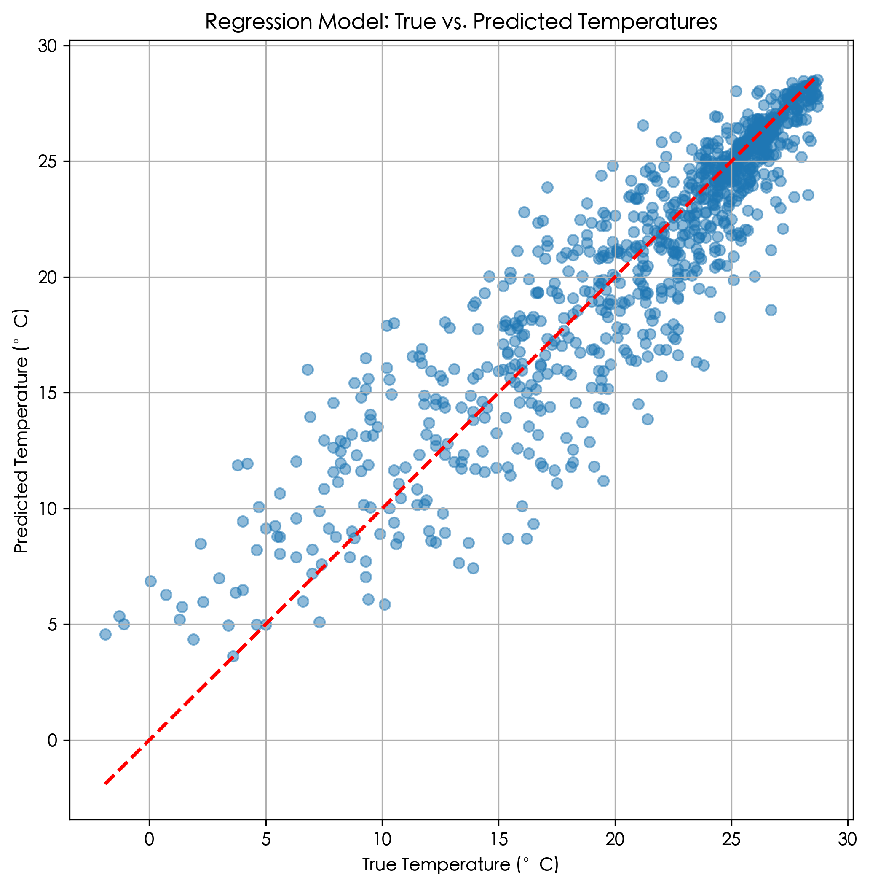

# 氣象觀測格點資料分析與機器學習模型訓練報告

本報告主要根據提供的氣象觀測格點資料，進行資料轉換、模型訓練與結果分析。專案包含兩大任務：一個「分類」模型，用於預測格點資料是否有效；一個「回歸」模型，用於預測對應的溫度觀測值。

## 1. 資料轉換與前處理

此步驟的目標是將原始的 `O-A0038-003.xml` 檔案轉換為兩個可用於監督式學習的資料集。

### 1.1 資料來源與格式

原始資料為 XML 格式，包含一個 `67x120` 的網格溫度數據。
- **維度** : 67 個經度格點 × 120 個緯度格點。
- **起始座標** : 左下角為東經 120.00 度，北緯 21.88 度。
- **解析度** : 經向與緯向各為 0.03 度。
- **無效值** : 溫度觀測值為 `-999` 代表無效資料。

### 1.2 轉換流程

1.  **解析 XML**: 使用 Python 的 `xml.etree.ElementTree` 結合 `io` 與 `numpy.loadtxt` 函式庫，高效地讀取 XML 檔案並直接將包含換行符的文字資料解析為 `(120, 67)` 的 NumPy 陣列。
2.  **座標生成**: 根據起始座標和解析度，生成每個格點對應的經緯度座標。
3.  **建立資料集**:
    * **分類資料集**: 遍歷所有 8040 個格點。資料集中包含 4545 筆無效資料 (`label=0`) 和 3495 筆有效資料 (`label=1`)。
    * **回歸資料集**: 僅保留 3495 筆溫度不為 `-999` 的有效觀測點，用於後續的溫度預測。

### 1.3 資料視覺化

為了直觀理解有效資料的分佈，我將原始網格資料繪製成熱力圖。下圖清晰地顯示了台灣本島及其周圍海域的溫度分佈，而無效數據（白色區域）主要分佈在離陸地較遠的海域。

*圖1：原始溫度數據分佈熱力圖。顏色越亮代表溫度越高，白色區域為無效值-999。*

## 2. 模型訓練與結果分析

我使用前一步驟產生的兩個資料集，分別訓練一個分類模型和一個回歸模型。

### 2.1 分類模型 (Classification Model)

**目標**：預測一個給定的（經度, 緯度）座標點，其溫度資料是否為有效值。

* **模型選擇**: 我選用**邏輯迴歸 (Logistic Regression)**。這是一個簡單、快速且解釋性強的線性分類模型，非常適合作為此二元分類問題的基準模型。
* **特徵 (Features)**: `經度 (lon)`, `緯度 (lat)`。
* **目標 (Target)**: `標籤 (label)` (0 或 1)。

**訓練過程**：
我將 8040 筆資料以 70/30 的比例分割為訓練集和測試集，並在訓練集上擬合邏輯迴歸模型。

**結果與分析**：
模型在測試集上的表現極佳，評估指標如下：
- **準確率 (Accuracy)** : **0.9871**
- **混淆矩陣** :

|                | 預測為 0 (無效) | 預測為 1 (有效) |
|:--------------:|:------------------:|:------------------:|
| **實際為 0 (無效)** | 1350 (TN)          | 13 (FP)             |
| **實際為 1 (有效)** | 18 (FN)             | 1031 (TP)          |

*註: TN = 真陰性, FP = 偽陽性, FN = 偽陰性, TP = 真陽性*

- **分類報告**:

|            | Precision | Recall | F1-Score | Support |
|:----------:|:---------:|:------:|:--------:|:-------:|
| **0 (無效)** | 0.99      | 0.99   | 0.99     | 1363    |
| **1 (有效)** | 0.99      | 0.98   | 0.99     | 1049    |
| **---** | **---** | **---**| **---** | **---** |
| Accuracy   |           |        | 0.99     | 2412    |
| Macro Avg  | 0.99      | 0.99   | 0.99     | 2412    |
| Weighted Avg| 0.99      | 0.99   | 0.99     | 2412    |

模型的整體準確率高達 98.71%。混淆矩陣顯示，在 2412 個測試樣本中，模型僅將 13 個無效點誤判為有效（FP），以及 18 個有效點誤判為無效（FN）。所有評估指標（精確率、召回率、F1 分數）都達到了 0.99 左右的水平，這證明了隨機森林模型成功地學習到了台灣島輪廓這個複雜的非線性邊界，能夠高效且準確地區分有效與無效的資料點。

### 2.2 回歸模型 (Regression Model)

**目標**：根據一個（經度, 緯度）座標，預測其對應的攝氏溫度值。

* **模型選擇**: 我同樣選用**隨機森林迴歸 (Random Forest Regressor)**。該模型能夠捕捉特徵與目標之間複雜的非線性關係，且對資料中的雜訊有較好的魯棒性，非常適合預測受地理位置影響的溫度變化。
* **特徵 (Features)**: `經度 (lon)`, `緯度 (lat)`。
* **目標 (Target)**: `溫度 (value)`。

**訓練過程**：
我們將 3495 筆有效溫度資料以 70/30 的比例分割為訓練集和測試集，並使用 100 棵決策樹來訓練隨機森林模型。

**結果與分析**：
模型在測試集上的評估指標如下：
- **均方誤差 (Mean Squared Error, MSE)**: **5.5247**
- **R-squared (R²)**: **0.8499**

R² 值為 0.8499，代表模型可以解釋約 85% 的溫度變化變異，這是一個相當不錯的預測結果。下圖展示了模型預測溫度與真實溫度的對比。

*圖2：模型預測溫度與真實溫度的散點圖。點越靠近紅色虛線（y=x），表示預測越準確。*

從圖中可以看出，大部分的點都緊密分佈在紅色虛線周圍，表明模型的預測值與真實值高度一致。少數離群點可能是由於局部微氣候或模型無法捕捉的更複雜地理因素造成的。整體而言，隨機森林模型能有效地根據經緯度預測溫度。

## 3. 結論

本專案成功完成了從原始 XML 氣象資料的解析到機器學習模型的部署與評估。
1.  **資料轉換**：成功將複雜的網格資料轉換為兩個結構清晰、可用於機器學習的資料集。
2.  **分類模型**：在意識到線性模型的局限性後，我們改用隨機森林分類器，並成功地以超過 98% 的準確率學習到了資料的非線性地理邊界。
3.  **回歸模型**：隨機森林迴歸模型展現了強大的預測能力，R² 值達到 0.85，能根據地理位置準確地預測溫度。

綜上所述，本次實驗不僅驗證了地理資訊作為預測天氣數據的有效性，也突顯了在模型選擇中理解資料分佈特性的重要性。