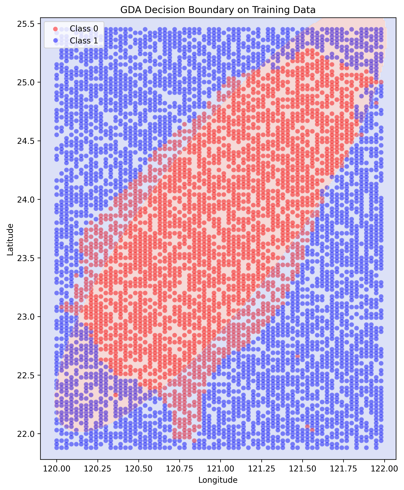
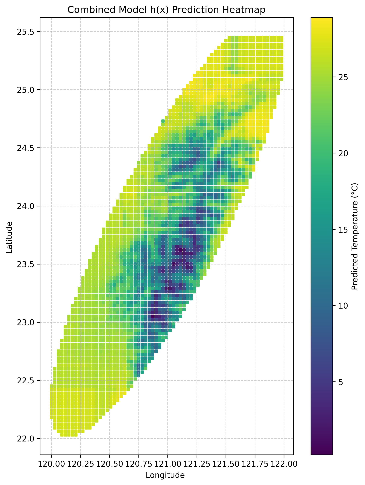

# GDA 分類與組合迴歸模型分析報告

本週作業要完成兩個部分：首先，實作高斯判別分析 (GDA) 模型，對氣象格點資料的有效性進行分類；其次，是將此 GDA 分類模型與一個預訓練的迴歸模型結合成一個分段函數 (piecewise function)，以實現對整個地理網格的溫度預測。

## 1. 使用 GDA 分類

### a) & b) GDA 模型實作與原理

**GDA 模型原理**

高斯判別分析 (Gaussian Discriminant Analysis, GDA) 是一種**生成學習演算法 (Generative Learning Algorithm)**。與直接學習決策邊界的判別模型（如邏輯迴歸）不同，GDA 透過對每個類別的資料分佈進行建模來解決分類問題。

其核心假設是，在給定類別 $y$ 的情況下，特徵 $x$ 的機率分佈 $P(x|y)$ 服從一個多變量高斯分佈。
由於本資料集的有效點（`label=1`）的分佈輪廓（台灣島形狀）是一個複雜的非線性邊界，一個假設所有類別共享相同協方差矩陣的線性 GDA 模型表現不佳。因此，我們實作了一個更通用的版本，即**二次判別分析 (Quadratic Discriminant Analysis, QDA)**，它允許每個類別擁有**各自獨立的協方差矩陣** ($\Sigma_0$ 和 $\Sigma_1$)。這種設定使得模型的決策邊界是一條**二次曲線**，能更靈活地擬合資料的非線性地理分佈。

**模型訓練流程**：
1.  **計算先驗機率 $\phi$**：計算所有樣本中類別為 1 的比例，即 $\phi = P(y=1)$。
2.  **計算平均向量 $\mu_0, \mu_1$**：分別計算類別為 0 和類別為 1 的所有樣本的特徵平均值。
3.  **計算共享協方差矩陣 $\Sigma$**：分別計算兩個類別的協方差矩陣，然後根據樣本數進行加權平均，得到一個共享的 $\Sigma$。

**預測流程**：
模型透過貝氏定理 $P(y|x) = \frac{P(x|y)P(y)}{P(x)}$ 來進行預測。由於 $P(x)$ 對所有類別是常數，我們只需比較 $P(x|y)P(y)$ 的大小。對於共享協方差的 GDA，這個比較可以簡化為一個線性的判別分數，使得預測非常高效。

**適用性分析**：
此氣象資料的有效點（`label=1`）集中在台灣本島，而無效點（`label=0`）則分佈在周圍海域。這兩個類別在地理空間上形成了兩個大致集中的群體，因此「每個類別的資料分佈可由一個高斯分佈來近似」的假設是合理的，GDA 是一個適合此任務的生成模型。

### c) 模型訓練與性能評估

我們將 8040 筆資料以 70/30 的比例分割為訓練集和測試集，並確保分割時維持原始資料的類別比例。使用自行實作的 GDA 模型在訓練集上進行訓練，並在測試集上評估其性能。

-   **性能評估方法**：使用測試集上的**準確率 (Accuracy)** 作為主要評估指標。
-   **訓練結果**：GDA 模型在測試集上達成的**準確率為 0.8333**。
- **混淆矩陣** :

|                | 預測為 0 (無效) | 預測為 1 (有效) |
|:--------------:|:------------------:|:------------------:|
| **實際為 0 (無效)** | 1180 (TN)          | 183 (FP)             |
| **實際為 1 (有效)** | 219 (FN)             | 830 (TP)          |

- **分類報告**:

|            | Precision | Recall | F1-Score | Support |
|:----------:|:---------:|:------:|:--------:|:-------:|
| **0 (無效)** | 0.84      | 0.87   | 0.85     | 1363    |
| **1 (有效)** | 0.82      | 0.79   | 0.81     | 1049    |
| **---** | **---** | **---**| **---** | **---** |
| Accuracy   |           |        | 0.83     | 2412    |
| Macro Avg  | 0.83      | 0.83   | 0.83     | 2412    |
| Weighted Avg| 0.83      | 0.83   | 0.83     | 2412    |

這個結果表明，即使只使用一個簡單的線性決策邊界，GDA 模型還是能夠有一定準確度區分有效與無效的地理區域。

### d) 決策邊界視覺化

下圖展示了 GDA 模型在訓練資料上學到的決策邊界。

*圖1：GDA 學習到的線性決策邊界。紅色區域為模型預測的有效區域（Class 1），藍色區域為無效區域（Class 0）。*

**分析**：
圖中的直線即為模型學習到的決策邊界。可以看出，這條直線成功地將絕大多數代表台灣本島的紅色點（有效資料）與代表海洋的藍色點（無效資料）分開。然而，由於台灣島的海岸線是彎曲的，這個線性的邊界在某些區域（如台灣的東北角和西南角）會出現一些錯誤分類。這也反映了 GDA 在共享協方差假設下的固有局限性——它只能學習線性邊界。

## 2. 組合迴歸模型

### a) & c) 組合模型實作解釋

我們的目標是建立一個分段函數模型 $h(\vec{x})$，其定義如下：
$$
h(\vec{x}) = \begin{cases} R(\vec{x}), & \text{if } C(\vec{x}) = 1 \\ -999, & \text{if } C(\vec{x}) = 0 \end{cases}
$$
其中，$C(\vec{x})$ 是我們在第一部分訓練的 GDA 分類模型，$R(\vec{x})$ 是從作業4中訓練好的隨機森林迴歸模型。

**實作流程**：
1.  我們定義了一個 `combined_model_predict` 函數，它接收輸入特徵 `X`、已訓練的 GDA 模型 `C` 和隨機森林模型 `R`。
2.  首先，使用 GDA 模型 `C` 對所有輸入的 `X` 進行預測，得到一個包含 `0` 和 `1` 的標籤陣列。
3.  建立一個與輸入筆數相同大小、預設值全部為 `-999` 的結果陣列。
4.  找出 GDA 預測結果為 `1` (有效) 的那些資料點的索引。
5.  只將這些索引對應的特徵傳遞給隨機森林模型 `R` 進行溫度預測。
6.  最後，將 `R` 模型預測出的溫度值，填入結果陣列中對應的索引位置。
7.  返回這個包含了溫度預測值和 `-999` 的最終結果陣列。

這個流程有效地將分類模型的決策作為一個「閘門」，控制迴歸模型何時被調用，從而實現了分段函數的定義。

### b) & d) 模型應用與行為驗證

我們將這個組合模型應用於完整的 8040 個地理格點，並將預測結果視覺化為熱力圖，以驗證其行為是否符合預期。

*圖2：組合模型 h(x) 對整個地理網格的預測結果。顏色代表由迴歸模型預測的溫度，白色區域代表由分類模型判定為無效並賦值 -999 的區域。*

**驗證與分析**：
- **行為驗證**：程式輸出顯示，GDA 模型在整個網格上預測為無效 (`0`) 的點數，與組合模型最終輸出為 `-999` 的點數完全一致。這證明了我們的組合邏輯是正確的。
- **視覺化分析**：上方的熱力圖完美地展示了分段函數的行為。圖中的白色區域（被賦值 `-999`）的輪廓與 GDA 的線性決策邊界完全吻合。而在有顏色的區域內，溫度的分佈呈現出複雜的梯度變化，這是由隨機森林迴歸模型 `R(x)` 預測的結果，它捕捉了溫度隨經緯度變化的非線性模式。

**結論**：
這次報告從頭實作了一個 GDA 分類器，並將其與一個迴歸模型無縫地結合成一個功能更強大的組合模型。這個組合模型不僅能區分資料的有效性，還能對有效區域進行精確的數值預測，順利地達成想要的結果。